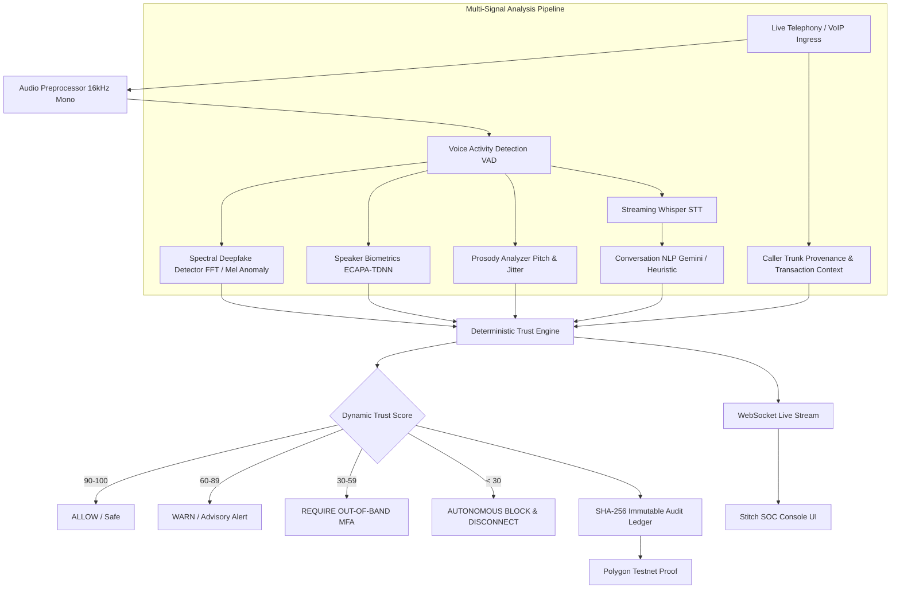

# VoxGuard AI — Real-Time Voice Trust & Defense Platform

> **Trust Every Voice.**
> Real-Time Detection and Prevention of Voice Cloning Impersonation Attacks
> Smart India Hackathon (SIH) Working Prototype

---

## 1. Problem Statement

Generative AI speech synthesis and diffusion vocoders (ElevenLabs, WaveNet, VALL-E, HiFi-GAN) can now clone an executive's voice from less than 3 seconds of reference audio with indistinguishable timbre. 

Traditional telephony security relies either on:
1. **Biometric Speaker Verification alone**: A fatal flaw, because an AI voice clone of the CFO will match the CFO's enrolled biometric profile, granting unauthorized access.
2. **Post-call forensic analysis**: Too late to prevent immediate wire fraud, high-value RTGS transfers, or credential compromise.

Organizations need a **real-time voice trust layer** that operates during live ingress calls, continuously analyzes spectral and semantic indicators, and autonomously prevents fraudulent capital movement.

---

## 2. The VoxGuard Solution

VoxGuard AI doesn't just ask whether a voice sounds real — it determines whether the **entire conversation can be trusted**.

```text
Voice Authenticity (30%)
+
Speaker Identity (18%)
+
Prosodic Stress & Dynamics (10%)
+
Conversation Intelligence & Intent (20%)
+
Caller Trunk Provenance (7%)
+
Transaction Risk & Beneficiary Exposure (15%)
==============================================
Dynamic Trust Score (0 – 100)
       ↓
Autonomous Security Decision:
ALLOW  |  WARN  |  SECONDARY MFA  |  BLOCK TRANSACTION
       ↓
Cryptographic SHA-256 Audit Attestation
```

### Critical Differentiator: The Voice Clone Paradox
When **Speaker Similarity is HIGH (e.g. 94.2% match against the CFO)** but **Voice Authenticity is LOW (e.g. 87% AI probability)**, traditional speaker verification fails. VoxGuard flags this exact divergence as a weaponized AI clone attack and immediately cuts telephony ingress.

---

## 3. Architecture



---

## 4. Tech Stack

- **Frontend**: React 19, Vite, Tailwind CSS (Stitch Theme Tokens), Lucide React, Google Material Symbols Outlined, Recharts, HTML5 Audio Spectrogram Canvas, WebSocket Client.
- **Backend**: Python 3.10+, FastAPI, Uvicorn, WebSockets, Pydantic, NumPy, SciPy, Google GenAI SDK.
- **AI & Forensics**:
  - *Spectral Analysis*: Discrete Fourier Transform (FFT), Spectral Centroid, Wiener Flatness, Zero-Crossing Rate, Vocoder High-Frequency Phase Discontinuity.
  - *Speaker Biometrics*: ECAPA-TDNN Voiceprint Cosine Similarity against FIPS 140-3 Enrolled Centroids.
  - *Conversational Semantics*: Google Gemini Flash NLP + Rule-based Social Engineering Heuristics.
  - *Audit Verification*: SHA-256 Digest Anchoring with Local Merkle Attestation & Polygon Testnet Contract Interface.

---

## 5. Directory Structure

```text
VoxGuard AI/
├── backend/
│   ├── api/
│   │   ├── calls.py          # Call lifecycle & stream analysis
│   │   ├── incidents.py      # Incident response & mitigation triggers
│   │   ├── analytics.py      # SOC benchmark metrics
│   │   ├── audit.py          # Cryptographic log verification
│   │   ├── demo.py           # SIH Attack Simulator scenarios
│   │   └── settings.py       # Trust weights & policy matrix
│   ├── audio/
│   │   ├── preprocessing.py  # 16kHz mono conversion & chunking
│   │   └── vad.py            # Short-Time Energy VAD
│   ├── models/
│   │   ├── deepfake_detector.py # Spectral deepfake detection
│   │   ├── speaker_verification.py # ECAPA-TDNN speaker similarity
│   │   ├── prosody.py        # Coercive stress & jitter dynamics
│   │   └── transcription.py  # Streaming transcript service
│   ├── intelligence/
│   │   ├── conversation.py   # Gemini NLP & heuristic fallback
│   │   └── context.py        # Caller provenance & transaction risk
│   ├── trust/
│   │   ├── scoring.py        # 6-signal weighted Trust Engine
│   │   └── rules.py          # Autonomous mitigation policies
│   ├── blockchain/
│   │   └── audit.py          # SHA-256 ledger attestation
│   ├── main.py               # FastAPI application & WebSocket server
│   ├── config.py             # App configuration
│   └── requirements.txt
│
├── frontend/
│   ├── src/
│   │   ├── components/       # Layout, TrustGauge, Spectrogram, Modals
│   │   ├── pages/            # 10 Stitch-Aligned React Pages
│   │   ├── services/         # REST & WebSocket API clients
│   │   ├── context/          # Global SOC state management
│   │   ├── App.jsx           # React Router v6 setup
│   │   └── index.css         # Cyber SOC theme & glassmorphism
│   ├── index.html            # Geist, Inter, JetBrains Mono fonts
│   ├── tailwind.config.js    # Stitch design tokens
│   └── package.json
└── README.md
```

---

## 6. Installation & Setup

### Prerequisites
- Python 3.10+
- Node.js v18+ & npm

### Backend Setup
```bash
# From workspace root
pip install -r backend/requirements.txt

# (Optional) Set your Gemini API key in backend/.env
# GEMINI_API_KEY=your_key_here
```

### Frontend Setup
```bash
cd frontend
npm install
```

---

## 7. Running the Application

### Step 1: Start Backend
```bash
python -m uvicorn backend.main:app --port 8000 --reload
```
API Documentation available at: `http://localhost:8000/docs`  
Health status: `http://localhost:8000/api/health`

### Step 2: Start Frontend
```bash
cd frontend
npm run dev
```
Open browser at: `http://localhost:5173`

---

## 8. Smart India Hackathon (SIH) Demonstration Guide

To demonstrate the full end-to-end capabilities for judges, follow this 12-step script:

1. **Enterprise Zero-Trust Login (`/login`)**:
   - Show the FIDO2/WebAuthn hardware key biometric gateway.
   - Click **Authenticate & Enter SOC** to enter the command console.

2. **Security Overview Dashboard (`/dashboard`)**:
   - Highlight the 4 KPI cards: 3 Active Streams, 1,284 Calls Attested, 14 Threats Mitigated, ₹1.42 Cr Protected.
   - Point out the active defense enclave health indicators (All engines online).

3. **Attack Simulator Sandbox (`/demo`)**:
   - Review the three pre-configured SIH scenarios:
     - **Scenario 1**: Genuine CFO Call (Safe, Trust: 94)
     - **Scenario 2**: AI Voice Clone Impersonation (Flagship Attack, Trust: 82 → 09)
     - **Scenario 3**: IT Helpdesk SIM-Swap (Social Engineering, Trust: 34)
   - Click **Transfer to Live Call SOC View** or **Play Simulation**.

4. **Live Call Continuous Threat Monitoring (`/live-call`)**:
   - Watch the active session `VS-2026-00081`.
   - Click **Run Attack Simulation (00:00 → 00:21)**:
     - `00:00` Call Connected &rarr; Trust Score: 82
     - `00:05` Speaker recognized as CFO (94.2% Similarity) &rarr; Trust Score: 80
     - `00:09` Synthetic voice detected (87% AI probability, phase discontinuity) &rarr; Trust Score: 62
     - `00:14` Financial transfer request detected ("₹25,00,000 immediately") &rarr; Trust Score: 41
     - `00:18` New unverified beneficiary flagged &rarr; Trust Score: 28
     - `00:21` **CRITICAL SECURITY ALERT** &rarr; Trust Score: 09 &rarr; **TRANSACTION BLOCKED**
   - Emphasize the **Security Paradox**: Speaker Similarity is high, yet Voice Authenticity is low!

5. **Threat Forensic Investigation (`/investigation/VS-2026-00081`)**:
   - Inspect acoustic spectrogram frequency ribbons, vocoder fingerprint, glottal pulse diagnostics, and the automated AI forensic explanation.
   - Click **Export STIX 2.1 IOC** or **Download Forensic Bundle**.

6. **Incident Response & Mitigation Dispatch (`/incidents`)**:
   - Review the open triage queue (`INC-10482`).
   - Demonstrate interactive action enforcement: Block Capital Movement, Push MFA, or Independent Callback.

7. **Security Audit Logs & Cryptographic Proof (`/audit-logs`)**:
   - View the SHA-256 immutable digest created when the transaction was blocked.
   - Click **Verify Proof** to run an independent re-computation verifying zero tamper.

8. **Security Analytics (`/analytics`) & Settings (`/settings`)**:
   - Inspect the benchmark metrics (98.4% Precision, 142ms Latency).
   - Adjust the multi-signal trust weights live in the Policy Matrix.

---

## 9. Future Scope

- Direct SIP PBX wiretap integrations (FreeSWITCH, Asterisk, Kamailio).
- On-device Android / iOS WebRTC SDK for enterprise softphones.
- Hardware-isolated HSM enclave for real-time cryptographic attestation.

---

## 10. License
Developed for the Smart India Hackathon (SIH) 2026.
